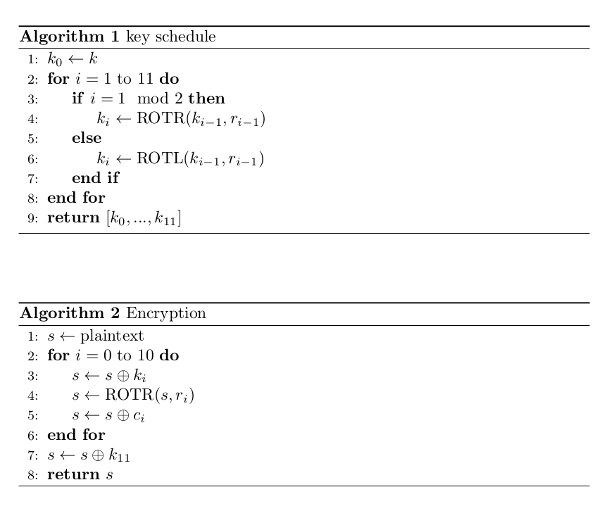

# RektSA 1 vs 100 

(Auteur: Titanex)

## Description

Voici la suite directe du challenge RektSA créé par [SIben](https://twitter.com/_siben_?lang=fr)

```
[FR]
Auteur : SIben Difficulté estimée : facile

Description : J'ai entendu que t'avais pas besoin de r dans la première version du challenge ? Et maintenant ?

http://finale-challs.rtfm.re:9002

[EN]
Author: SIben
Estimated difficulty: easy

Description: Heard you didn't need r to solve the first version of the challenge? How about now?

http://finale-challs.rtfm.re:9002
```

## Le challenge

Commençons par lire le fichier encrypt.py joint au challenge :

```python
#!/usr/bin/python2.7

import sys
from secret import FLAG
from Crypto.Util.number import getPrime, bytes_to_long
from gmpy2 import invert

for _ in range(100):
    p = getPrime(1024)
    q = getPrime(1024)
    r = getPrime(1028)

    e = 0x10001

    N = p * q * r
    phi = (p - 1) * (q - 1) * (r - 1)
    print 'p =', p
    print 'q =', q
    print 'N =', N
    print 'true_phi =', phi
    print 'phi =', phi % 2**2050
    print 'r =', r

    print 'Give me d, p and q: '

    sys.stdout.flush()

    try:
        d, p, q = [int(inp) for inp in raw_input().split(' ')]
    except:
        print 'Invalid input!'
        exit(1)

    if d == invert(e, phi) and p * q * r == N:
        continue
    
    print 'Nope!'
    exit(1)

print 'Congratulations: %s' % FLAG
```

Comme nous nous y attendions au vu du nom du challenge, le script est très proche du challenge initial.  
L'unique différence est qu'il faut trouver p et q en plus de d. Challenge accepted !

## Résolution
### Trouver d

Je ne reviendrais pas sur cette partie, car elle est très bien documentée par les write-ups disponibles sur le site de [rtfm.re](https://rtfm.re/writeups.html)

### Trouver p et q

Pour trouver p et q, nous allons utiliser d, qui est l'exposant de déchiffrement dans un système RSA.

Pour rappel: 
- chiffrer un message dans RSA : `c = m ** e mod n`
- déchiffrer un message dans RSA : `m = c ** d mod n`
- et donc, `d * e = 1 mod n`

Ici, une des possibilités serait de se plonger dans l'arithmétique, mais gardons cela pour les autres challenges.  
J'ai choisi la solution de réutiliser un code déjà fonctionnel très utilisé dans les challenges de crypto RSA : [rsatool](https://github.com/ius/rsatool)  

En effet, ce code offre la possibilité de récupérer les nombres premiers d'une clé RSA en lui donnant l'exposant de déchiffrement et N. Le seul travail à faire est donc d'adapter la fonction pour un RSA multiprime ou d'adapter notre problème à un RSA classique. Une petite modification aussi pour la rendre compatible Python3.

```python
def factor_modulus(n, d, e):
    """
    source : https://github.com/ius/rsatool/blob/master/rsatool.py

    Efficiently recover non-trivial factors of n
    See: Handbook of Applied Cryptography
    8.2.2 Security of RSA -> (i) Relation to factoring (p.287)
    http://www.cacr.math.uwaterloo.ca/hac/
    """
    t = (e * d - 1)
    s = 0

    while True:
        quotient, remainder = divmod(t, 2)
        if remainder != 0:
            break
        s += 1
        t = quotient
    found = False

    while not found:
        i = 1
        a = random.randint(1,n-1)
        while i <= s and not found:
            c1 = pow(a, pow(2, i-1, n) * t, n)
            c2 = pow(a, pow(2, i, n) * t, n)
            found = c1 != 1 and c1 != (-1 % n) and c2 == 1
            i += 1

    p = math.gcd(c1-1, n)
    q = n // p
    return p, q
```

Par chance, nous connaissons déjà r, c'est-à-dire 1 facteur sur les 3. Nous pouvons donc réduire le problème à un RSA classique, car :
- `phi(p * q * r) = (p-1) * (q-1) * (r-1)` => permet de récupérer l'exposant de déchiffrement de notre système RSA multiprime.
- `phi(p * q)     = (p-1) * (q-1)`         => permet de récupérer l'exposant de déchiffrement du système RSA où `n = p * q = N // r`

Hors nous connaissons `phi(p * q)`,puisque `phi(p * q) = phi(p * q * r) / (r-1)`  
Ainsi, nous pouvons adapter notre problème à la fonction de rsatool.

Et voici le flag : `Congratulations: sigsegv{s0_y0u_c4n_s0lv3_1t_w1th_r_4ft3r_4ll...}`

## Script

Voici la boucle finale (code basé sur la solution de [Asterix45](https://rtfm.re/writeups/Asterix45.html)) :
(L'objet `Server` représente votre librairie préférée pour gérer les sockets)

[Lien vers le script](rektsa_1_vs_100/solve.py)


------

# Alice au pays des block-ciphers

(Auteur: Titanex)

## Description

Voici un petit challenge par JcVd sur un block cipher custom parce que nous savons tous que AES n'est pas sûr du tout.

```
[FR]
Auteur : JcVd
Difficulté estimée : moyenne

Description :
Alice a décidé d'implémenter son propre block cipher. Vous avez un ciphertext, quelques paramètres, et une vue d'ensemble de l'algorithme à votre disposition. Retrouvez le texte en clair !

[EN]
Author: JcVd Estimated difficulty: medium

Description:
Alice decided to implement her own block cipher. You're given a ciphertext, some parameters, and an overview of the algorithm. Get the plaintext back!
```

## Le challenge

Nous avons à notre disposition l'algorithme en pseudo-code utilisé par Alice pour communiquer avec Bob.



Oscar ayant intercepté un message, nous devons le décrypter:

```python
ciphertext = '0dede85ca916c63e83eefb630ff1c6802fd38478eb62683ce9b69763dbafca80'
c = ['68636d62627672786f626e656e616771',
     '6870666a7a796f6c67737477696c6772',
     '63796a7476616a72676a7373796f6969',
     '786d696578756963796971616e6d787a',
     '6777766d6e747571656a656b667a6c75',
     '7a6b6c6a636c6f6972747a7371636d65',
     '6f6c7376747a737471637a636e61796d',
     '686e6c746266686b7a6b796c707a6c66',
     '7476646b646a78677571656561726c79',
     '757974736a756165706f747472627479',
     '6c6e6c696d6e70767a72737565766973',
     '6a787a727465756e7362637374747368']
r =  [97, 115, 27, 44, 92, 55, 27, 73, 120, 13, 112, 1]

# Good luck!
```

Généralement, les challenges sur les blocks ciphers se résolvent en écrivant les équations liant le message, la clé et le chiffré. Sinon, vous remarquez une caractérisque particulière sur les vecteurs générés et dans ce cas, des solvers comme [Z3](https://github.com/Z3Prover/z3) peuvent être utiles.

## Résolution

### Paramètres et fonctions de l'algorithme

Avant d'aller plus loin, nous devons trouver la taille des vecteurs de la clé et du message. En analysant les datas, nous voyons que les éléments de c sont des vecteurs de 16 octets sous forme hexadécimale (32 caractères).

Le vecteur r est composé aussi de 16 éléments. Nous en déduisons que la clé fait 16 éléments, car la clé subit une rotation de r éléments soit par la gauche (ROTL) ou par la droite (ROTR).

Nous avons donc 2 blocs de message dans le ciphertext (64 caractères hexadécimaux => 32 octets de donnés).

Pour finir, les fonctions ROTL et ROTR vont agir sur l'ensemble des bits et non pas sur les octets du vecteur en entrée, car les éléments de R sont compris entre 0 et 128 (128 = 8\*16).

### Trouver les équations

Voulant éviter d'utiliser mes derniers cachets d'aspirines, je préfère scripter le système cryptographique pour en ressortir les équations.

Pour ce faire, nous allons définir 2 vecteurs où chaque élément représente un bit et nous travaillerons uniquement sur 0 et 1 pour les valeurs entières :
- un vecteur m de 128 éléments: `["m1",...,"m128"]`
- un vecteur k de 128 éléments: `["k1",...,"k128"]`

Les vecteurs c devront être convertis à des vecteurs d'entiers (0 ou 1) de 128 éléments.  

```python
new_c = []
for vc in c:
    new_vc = []
    for i in range(0,len(vc),2):
        for b in bin(int(vc[i:i+2],16))[2:].zfill(8):
            new_vc.append(int(b,2))
    new_c.append(new_vc)
c = new_c
```
Les fonctions doivent être implémentées pour simuler les opérations souhaitées (xor, rotation) sur les chaines de caractères.

Et enfin, il est impératif de simplifier les équations pour la lisibilité des équations. Par chance, la seule opération présente est le xor qui se simplifie trés simplement :
- `"m42 ^ m42"` donne `"0"`
- `"m42 ^ m42 ^ 1"` donne `"1"`
- `"m42 ^ 1 ^ 1"` donne `"m42"`

```python
m = ["m%s" % i for i in range(128)]
k = ["k%s" % i for i in range(128)]
```

Voici l'implémentation du système cryptographique d'Alice prêt à nous donner les équations :

```python
import re

def simplifyXor(equation,mult=False):
    operands = list(set(equation.split('^')))
    operands.sort()
    dict_operand = {}
    for operand in operands:
        count = len(re.findall('(?=\^%s\^)'%operand.replace('[','\[').replace(']','\]').replace('*','\*'),equation))
        count += len(re.findall('(?=^%s\^)'%operand.replace('[','\[').replace(']','\]').replace('*','\*'),equation))
        count += len(re.findall('(?=\^%s$)'%operand.replace('[','\[').replace(']','\]').replace('*','\*'),equation))
        dict_operand[operand] = count % 2 # We are xorring, so we have to keep only the operands appearing an odd number of times.
    equation = ""
    xor_equation_value = 0
    for operand, count in dict_operand.items():
        if count == 1: # the operand must be kept
            if 'k' in operand or 'm' in operand:
                equation += "^"+operand
            else:
                xor_equation_value ^= int(operand) # the integers are xorred together to have more than one at the end (xor is commutative and associative)
    if xor_equation_value != 0:
        equation += "^"+str(xor_equation_value)
    equation = equation[1:]
    return equation


def sROTR(key,r):
    return key[-r:] +  key[:-r]

def sROTL(key,r):
    return key[r:] +  key[:r]

def sXor(a,b):
    res = []
    for i in range(len(a)):
        res.append(simplifyXor("%s^%s" % (a[i],b[i])))
    return res

def sRound_key(key,r):
    keys = [key]
    for i in range(1,12):
        if i % 2 == 1:
            keys.append(sROTR(keys[i-1],r[i-1]))
        else:
            keys.append(sROTL(keys[i-1],r[i-1]))
    return keys

def sEncrypt(plain,key,r,c):
    keys = sRound_key(key,r)
    print("--- round keys ---")
    print(len(keys))
    for k in keys:
        print(k)
    cipher = plain
    for i in range(11):
        print("--- Step",i,"---")
        cipher = sXor(cipher,keys[i])
        print("Xor  :",cipher)
        cipher = sROTR(cipher,r[i])
        print("Rotr :",cipher)
        cipher = sXor(cipher,c[i])
        print("Xor  :",cipher)
    cipher = sXor(cipher,keys[11])
    print("--- Encrypt :",cipher)
    return cipher
```

Ce code nous génère les équations suivantes :

```
--- Encrypt : ['m121^1', 'm122^1', 'm123', 'm124^1', 'm125', 'm126^1', 'm127', 'm0^1', 'm1', 'm2', 'm3', 'm4', 'm5^1', 'm6', 'm7^1', 'm8^1', 'm9', 'm10', 'm11^1', 'm12^1', 'm13^1', 'm14', 'm15^1', 'm16', 'm17^1', 'm18', 'm19', 'm20^1', 'm21', 'm22', 'm23^1', 'm24', 'm25', 'm26^1', 'm27', 'm28', 'm29^1', 'm30^1', 'm31^1', 'm32^1', 'm33^1', 'm34^1', 'm35', 'm36^1', 'm37^1', 'm38^1', 'm39', 'm40', 'm41', 'm42', 'm43', 'm44', 'm45^1', 'm46', 'm47', 'm48', 'm49^1', 'm50^1', 'm51', 'm52^1', 'm53', 'm54', 'm55^1', 'm56', 'm57', 'm58^1', 'm59^1', 'm60^1', 'm61', 'm62^1', 'm63', 'm64^1', 'm65', 'm66', 'm67', 'm68', 'm69^1', 'm70', 'm71', 'm72', 'm73', 'm74^1', 'm75', 'm76^1', 'm77', 'm78', 'm79', 'm80^1', 'm81^1', 'm82', 'm83', 'm84', 'm85', 'm86^1', 'm87^1', 'm88^1', 'm89', 'm90^1', 'm91^1', 'm92', 'm93^1', 'm94', 'm95', 'm96^1', 'm97', 'm98^1', 'm99', 'm100', 'm101^1', 'm102^1', 'm103^1', 'm104^1', 'm105', 'm106', 'm107^1', 'm108', 'm109', 'm110', 'm111^1', 'm112', 'm113^1', 'm114^1', 'm115^1', 'm116', 'm117', 'm118', 'm119', 'm120']
```

Nous avons donc `c1 = m121 ^ 1`, etc... Ce qui veut dire que l'algorithme d'Alice génère un ciphertext indépendant de la clé utilisée. Amusez-vous à commenter les lignes utilisant les clés dérivées, vous obtiendrez le même résultat. 

### Décryptage

Eh bien, il ne reste plus qu'à appliquer ces équations sur le ciphertext qui sera converti en 2 vecteurs de bits:

```python
new_ciphertexts = []
for vc in [ciphertext[:16],ciphertext[16:]]:
    new_vc = []
    for i in vc:
        for b in bin(i)[2:].zfill(8):
            new_vc.append(int(b,2))
    new_ciphertexts.append(new_vc)
ciphertexts = new_ciphertexts

flag = ""
for ciphertext in ciphertexts:
    i = 0
    plain = ["_"]*128
    for equation in e:
        index = int(re.findall('m[0-9]+',equation)[0][1:]) # message bit index
        plain[index] = ciphertext[i]
        if '^' in equation :
            plain[index] ^= int(equation.split('^')[1])
        i+=1
    ascii_plain = ""
    for i in range(0,len(plain),8):
        ascii_plain += chr(int("".join([str(p) for p in plain[i:i+8]]),2))
    flag += ascii_plain
print(flag)
```

Et le flag tombe immédiatement : `sigsegv{sUr3_r0ll_uR_0wN_crYpt0}`

[Lien vers le script](alice/solve.py)

------

# Crypto Calculous

(Auteur: Titanex)

## Description

Voici un challenge rigolo proposé par [Alkanor](https://twitter.com/Alka_Nor) de par sa conception peu commune.

```
[FR]
Auteur : Alkanor
Difficulté estimée : Moyenne (niveau 1)/Difficile (niveau 2)

Description :
Niveau 1: "Notre service de factorisation en nombres premiers s'est un peu emballé et commence à générer des chaînes de caractères bizarres. Pouvez-vous le réparer ?"
Niveau 2: "Le service de factorisation a malheureusement détecté vos tentatives pour retrouver la valeur de ses chaînes de caractères. Il a décidé de vous complexifier la tâche."

Niveau 1 : finale-challs.rtfm.re:5555 Niveau 2 : finale-challs.rtfm.re:5557

[EN]
Author : Alkanor
Estimated difficulty: Medium (level 1)/Hard (level 2)

Description :
Level 1: "Our last generation prime factorization service has become crazy and it started to generate weird random strings. Are you able to fix it ?"
Level 2: "The factorization service has detected your attempts to find back the real string values. He decided to make your life a hell"

Level 1: finale-challs.rtfm.re:5556 Level 2: finale-challs.rtfm.re:5558
```

Deux archives sont fournies avec ce challenge [level1](crypo_calculous/level1.tar.xz) et [level2](crypo_calculous/level2.tar.xz)
Celles-ci contiennent quasiment la même chose :

```
ll -R
.:
total 20
drwxrwxrwx 1 titanex titanex 4096 déc.   1 03:53 ./
drwxrwxrwx 1 titanex titanex 4096 déc.   1 03:53 ../
drwxrwxrwx 1 titanex titanex 4096 déc.   1 03:53 FR_words/
-rwxrwxrwx 1 titanex titanex 1731 nov.  17 19:20 generate_corpus.py*
-rwxrwxrwx 1 titanex titanex 4998 nov.  17 19:20 index_calculus_en.py*
-rwxrwxrwx 1 titanex titanex 5132 nov.  17 19:20 index_calculus_fr.py*
-rwxrwxrwx 1 titanex titanex   29 nov.  17 19:20 secret.py*

./FR_words:
total 8
drwxrwxrwx 1 titanex titanex 4096 déc.   1 03:53 ./
drwxrwxrwx 1 titanex titanex 4096 déc.   1 03:53 ../
-rwxrwxrwx 1 titanex titanex  777 nov.  17 19:20 adjs96FR.txt*
-rwxrwxrwx 1 titanex titanex 2298 nov.  17 19:20 noms294FR.txt*
-rwxrwxrwx 1 titanex titanex  380 nov.  17 19:20 verbes50FR.txt*
```

Nous avons tout ce qu'il faut pour faire tourner le challenge en local (avec socat par exemple : `socat TCP-LISTEN:4242,reuseaddr,fork,bind=127.0.0.1 "EXEC:../level1/index_calculus_fr.py"`)

Nous allons résoudre les 2 étapes en même temps, car le script de résolution est identique pour la première et la deuxième étape.

## Le challenge

### Le serveur
Commençons par analyser ce que nous envoie le serveur :

```
~~~~~~~ Super service de factorisation à ton service ~~~~\~\~~
Tu peux demander des factorisations quelconques dans un espace un peu particulier
Pour cela, tu pourras rentrer lignes par ligne des expressions comme connaître_une_part_bizarre_et_dire_une_madame_juste-3
L'expression indiquée correspond à un nombre entre 2 et 15361368, à la puissance 3
Chaque ligne X-n que tu ajoutes est une multiplication supplémentaire par X^n
Puis quand tu as fini, tu obtiens la décomposition en facteurs premiers du produit

Pour obtenir le flag, tu dois répondre à la question suivante :
Combien de aimer_une_confiance_facile_et_aller_une_erreur_jolie y a-t-il dans laisser_une_ombre_gentille_et_chercher_un_intérieur_faux ?
Bon chance (tu as droit à 1500 requêtes)

Quoi faire ?
[+] 1 - Décomposer un produit
[+] 2 - Demander le flag
[.] 3 - Quitter
```

Nous avons donc de la factorisation dans un espace un peu étrange puisque celui ne semble être composé que de morceaux de texte générés aléatoirement.  
Nous devons répondre à la question suivante : `Combien de A y a-t-il dans B ?`  
L'énoncé nous indique que nous allons travailler dans l'ensemble [2,p] (dans l'exemple p = 15361368).

Nous avons le droit à 1500 requêtes au serveur.

Voilà pour les informations que nous pouvons tirer du serveur. Passons maintenant au code source du challenge.

### Le code source

#### Le main

Commençons par la fin du fichier index_calculous.py qui est le commencement :

```python
if __name__ == "__main__":
    N = 4500
    n_iteration_max = 1500

    i_to_s, s_to_i = generate_initial_table(N)
    P, A, B = generate_params()

    print("~~~~~~~ Super service de factorisation à ton service ~~~~~~~")
    print("Tu peux demander des factorisations quelconques dans un espace un peu particulier")
    print("Pour cela, tu pourras rentrer lignes par ligne des expressions comme {}-3".format(convert_i_to_s(4500*3256+1829, i_to_s, N)))
    print("L'expression indiquée correspond à un nombre entre 2 et {}, à la puissance 3".format(P-1))
    print("Chaque ligne X-n que tu ajoutes est une multiplication supplémentaire par X^n")
    print("Puis quand tu as fini, tu obtiens la décomposition en facteurs premiers du produit\n")

    print("Pour obtenir le flag, tu dois répondre à la question suivante :")
    print("Combien de {} y a-t-il dans {} ?".format(convert_i_to_s(A, i_to_s, N), convert_i_to_s(B, i_to_s, N)))
    print("Bon chance (tu as droit à {} requêtes)\n".format(n_iteration_max))

    for _ in range(n_iteration_max):
        print("Quoi faire ?")
        print("[+] 1 - Décomposer un produit")
        print("[+] 2 - Demander le flag")
        print("[.] 3 - Quitter")
        sys.stdout.flush()
        ans = sys.stdin.readline()
        
        if ans[0] == '1':
            decompose(s_to_i, i_to_s, N, P)
        elif ans[0] == '2':
            if ask_flag(A, B, P, N):
                print("Bien joué, tiens le flag pour toi: {}".format(FLAG))
            else:
                print("Dommage, ça n'est pas du tout ças, heureusement tu pourras recommencer !")
            exit()
        else:
            print("Ok, tu quittes sans avoir fini, mais tu dois avoir tes raisons j'imagine.")
            print("Bye")
            exit()
    
    print("Tu as travaillé dur mais tu as dépassé le nombre de requêtes autorisées malheureusement.")
    print("Bye")
    exit()
```

Ici, nous avons :
- la définition de N (level 1 = 4500 et level 2 = 200000)
- la génération du corpus
- quelques premiers éléments du corpus qui serviront de point de départ `print("Pour cela, tu pourras rentrer lignes par ligne des expressions comme {}-3".format(convert_i_to_s(4500*3256+1829, i_to_s, N)))`
- P nous est envoyé
- 2 actions possibles:
	- Décomposer un produit -> fonction `decompose`
	- Demander le flag -> fonction `ask_flag`

#### Les fonctions "d'aides"

Nous savons que les fichiers dans FR_words et le script generate_corpus (la version level2 est légèrement différente, mais sert exactement à la même chose) permettent de générer un corpus associant un entier à une chaine de caractères gâce à la fonction `generate_initial_table` :
```python
def generate_initial_table(N):
    i_to_s = {}
    s_to_i = {}
    for i, c in enumerate(generate_corpus_from_files(os.path.join(os.path.dirname(__file__),"FR_words/verbes50FR.txt"),\
                                                     os.path.join(os.path.dirname(__file__),"FR_words/noms294FR.txt"),\
                                                     os.path.join(os.path.dirname(__file__),"FR_words/adjs96FR.txt"), N)):
        i_to_s[i] = c
        s_to_i[c] = i    
    return i_to_s, s_to_i
```

Ainsi, pour chaque entier, nous avons un morceau de texte associé. Exemple:
```
{0: 'appeler_un_compte_plein', 1: 'passer_un_droit_certain', 2: 'sentir_un_merci_diff\xc3\xa9rent', 3: 'penser_une_nuit_libre',
```

Cet ensemble est de taille N. Cette taille est modifiée entre le level 1 (N = 4500) et le level 2 (N = 200000).

Ensuite nous avons la génération des paramètres :

```python
def generate_params():
    p = generate_prime(24)
    A = random.randint(2, p-1)
    r = random.randint(2, p-1)
    B = pow(A, r, p)
    return p, A, B
```

p est un nombre premier de 24 bits (c'est un petit nombre).
r semble être la solution attendue, car A et B sont envoyés par le serveur. Cette hypothèse sera confirmée par la suite de l'analyse.
Au vu de l'exponentiation modulaire utilisée, nous devons donc retrouver r tel que `B = A ** r mod p`. Ceci est un problème de [logarithme discret](https://en.wikipedia.org/wiki/Discrete_logarithm) dans le [groupe fini](https://en.wikipedia.org/wiki/Finite_group) Zp.

Les fonctions `convert_i_to_s`,`convert_s_to_i` et `decomposition_string` sont utilisées pour convertir une chaine de caractère en entier ou inversement.
Celles-ci permettent de savoir comment sont décrits les nombres dans le nouvel alphabet :
- si l'entier A est supérieur à N, alors la chaine renvoyée est la concaténation du quotient Q et de son reste R de la division euclidienne par N par le mot clé `_et_`. Schématiquement si `A = Q * N + R`, la chaine sera équivalente à `Q_et_R` (et réciproquement)
- sinon la chaine renvoyée est tout simplement la chaine représentant R (le reste de la division par N car A < N).

Cela nous permet donc d'avoir un ensemble Zp décrit qu'avec des éléments de ZN.

Attaquons-nous aux deux actions possibles.

#### Action 1 : Décomposer un produit

Voici le code associé à la décomposition :

```python
def decompose(s_to_i, i_to_s, N, P):
    print("Tes lignes x-n pour le produit des x^n ? (ligne vide pour finir)")
    sys.stdout.flush()
    ans = sys.stdin.readline()[:-1]
    lines = []
    while ans:
        try:
            x, n = ans.split("-")
            if "_et_" in x:
                h, l = x.split("_et_")
                if h not in s_to_i:
                    print("{} n'est pas dans la liste des mots connus".format(h))
                elif l not in s_to_i:
                    print("{} n'est pas dans la liste des mots connus".format(l))
                else:
                    X = convert_s_to_i(h, l, s_to_i, N)
            else:
                if x in s_to_i:
                    X = s_to_i[x]
                else:
                    print("{} n'est pas dans la liste des mots connus".format(x))
            lines.append((X, int(n)))
        except:
            print("Arf, ça n'est pas le bon format et ta ligne précédente n'a pas été prise en compte")
        sys.stdout.flush()
        ans = sys.stdin.readline()[:-1]
    product = 1
    for x, n in lines:
        product = (product*pow(x, n, P))%P
    primes = factorint(product)
    print("Voilà ta décomposition :")
    # print(" * ".join(map(decomposition_string(i_to_s, N), lines)) + " (mod P) = " + " * ".join(map(decomposition_string(i_to_s, N), sorted(primes.items())))) # un peu trop facile
    print(" * ".join(map(decomposition_string(i_to_s, N), lines)) + " (mod P) = " + " * ".join(map(decomposition_string(i_to_s, N), primes.items())))
```

Après analyse, on se rend compte que l'on peut envoyer une chaine représentant un nombre par ligne. Ensuite, ces nombres sont multipliés entre eux. Les exposants n'ont pas de contrainte particulière.  
Une fois le produit recomposé, le serveur nous renvoie sa décomposition en facteurs premiers dans l'alphabet défini par le corpus. Sauf que la décomposition n'est pas envoyée de manière triée. Prenons un exemple pour voir en quoi cela nous complique la vie.  

Nous souhaitons obtenir la décomposition de `564 = 2 ** 3 * 3 * 94`. 
Supposons que nous connaissons la chaine C à envoyer au serveur pour obtenir un produit égal à 564.
Le serveur va nous retourner la réponse suivante : `C = chaine1 ** 3 * chaine2 * chaine3`
Donc pouvons donc déduire que la représentation de 2 dans le corpus est `chaine1`, car l'exposant 3 n'est présent qu'une fois dans la décomposition. Le lien est immédiat.
Pour les deux autres facteurs, nous ne pouvons pas dire laquelle des chaines correspond à 3 ou 94, car l'ordre des facteurs n'est pas garanti (ce n'est pas obligatoirement du plus petit au plus grand, car `primes` est un dictionnaire). Nous devrons donc gérer ce problème pour construire notre corpus.

#### Action 2 : Demander le flag

```python
def ask_flag(A, B, P, N):
    print("Alors tu as trouvé combien de {} il y avait dans {} ?".format(convert_i_to_s(A, i_to_s, N), convert_i_to_s(B, i_to_s, N)))
    sys.stdout.flush()
    ans = int(sys.stdin.readline()[:-1])
    if pow(A, ans, P) == B:
        return True
    return False
```

Pour cette partie, nous n'aurons pas besoin de traduire la réponse.  
La ligne `if pow(A, ans, P) == B:` nous confirme le problème de logarithme discret.

#### Résumons la situation

Nous devons donc résoudre un problème de logarithme discret dans Zp décrit par un ensemble d'éléments appartenant à ZN, c'est-à-dire résoudre l'équation `B = A ** solution mod p`
Nous ne pouvons qu'envoyer des chaines de caractères pour décrire nos nombres. Seules les puissances et la réponse à la question peuvent être envoyées en tant que numéros.

Notre premier objectif est de remplir suffisamment notre corpus pour traduire les chaines de caractères représentant A et B.
notre deuxième objectif est de résoudre le logarithme discret.

## Résolution

### Stratégie

Nous avons les chaines représentant le quotient et le reste de A et B de par l'énoncé, nous pouvons donc demander au serveur les chaines décrivant leur décomposition en facteurs premiers. En effet, si nous avons la correspondance de ces chaines, nous serons en mesure de reconstruire A et B et ensuite de résoudre le challenge. Nous allons donc demander un par un les nombres premiers.

De plus, cela a pour avantage de limiter la traduction nécessaire du corpus aux seuls nombres premiers (610 éléments pour le level 1, 17984 éléments pour le level 2).  
L'autre avantage qui est purement empirique à la suite de mes tests, c'est qu'il arrive très souvent que A et B se décomposent à l'aide de facteurs premiers inférieurs à 1000.  
Malheureusement, la solution exposée ne marchera pas dans 100% des cas pour le level2, car nous pouvons récupérer que 1500 éléments, mais marchera dans 30% à 40% des cas (toujours d'après mes tests), c'est suffisant pour résoudre le challenge et elle fonctionne pour les 2 levels, nous gagnons du temps.

### Remplir le corpus

Alors pour cette partie, j'ai choisi d'avoir 2 classes:
- `Number` : classe stockant en variable de classe notre corpus avec toutes les fonctions qui vont bien pour simplifier le code (ce n'est pas un code optimisé pour la performance)
- `SubCorpus` : classe définissant un "sous-corpus" représentant la décomposition en facteurs premiers d'un nombre. Il y a deux variables : `factor` et `sfactor`, qui sont des dictionnaires où la clé représente la puissance du/des facteur(s) et la valeur associée est un tableau du/des facteur(s) associé(s) à ladite puissance. `factor` est un dictionnaire dans le monde classique des nombres, `sfactor` est un dictionnaire pour le monde lié au corpus du challenge. Cette classe possède une liste avec tous les subcorpus non vides et avec lesquels ne nous pouvons pas déduire des traductions.

Lors de la création d'un subcorpus, je vérifie s'il est possible de supprimer des éléments que nous connaissons déjà pour ensuite essayer d'en déduire d'autres éléments avec les factors et sfactors restants. Une fois cette étape faite, je compare tous les subcorpus ensemble. Lors de la comparaison, je regarde l'intersection d'un élément avec tous les autres (j'enlève les cas où l'intersection est vide ou pleine puisque nous ne pouvons rien déduire) :
- si cette intersection est composée d'un seul élément, alors nous avons une traduction en plus
- sinon je calcule le xor des deux corpus vérifier si je peux en extraire des informations 
Et je recommence ceci jusqu'à que je ne fasse plus de modification dans la liste des subcorpus.

Cette méthode est générique par rapport à la génération du nombre demandé, mais assez lourde en mémoire. Jai pu la tester à l'aide de la décomposition de nombres générés aléatoirement à partir de mon corpus.

Il faut noter que par rapport à la stratégie choisie, tous ces traitements ne sont pas nécessaires, car nous aurons à chaque fois un seul élément dans la décomposition. Ils sont cependant intéressants et permettent de programmer un peu autour des ensembles.

### Tout est une question de logarithmes discrets

Bon, maintenant, nous devons demander au serveur des nombres bien précis. Comment s'assurer que la décomposition en facteurs premiers soit composée d'un unique élément ? Eh bien, en résolvant un logarithme discret ! J'utiliserais Sympy qui possède une fonction qui va utiliser le meilleur algorithme de résolution d'un logarithme discret (qui est un problème très compliqué pour de grands chiffres, mais ici, p n'est que de 24 bits donc tout petit). En alternative, vous pouvez aussi utiliser SageMath.

En effet, nous avons la relation suivante : si `D = C ** (e * i) mod P` avec i entier et que `e * i < P`, alors la décomposition de B sera égale à la décomposition de e.  
Exemple: si `e = 2 * (3 ** 2) * (5 ** 3)`, i = 1 et P > 2250, alors `decomposition(D) = 2 * (3 ** 2) * (5 ** 3)`. Le serveur nous retournera donc la chaine correspondante à 2, puis à 3 et enfin à 5, et comme les puissances associées aux facteurs sont différentes à chaque fois, nous récupérons ainsi la traduction des 3 facteurs dans le corpus du challenge.

Il suffit donc de demander un nombre où e sera un nombre premier ou une composition bien choisie (inférieure à P et composée de d'élements avec des facteurs uniques). De ce fait, nous avons la garantie de pouvoir associer un nombre avec sa phrase. 

Nous pouvons maintenant passer à la dernière étape.

Une fois que nous avons les éléments de A et B, nous arrêtons de remplir le corpus, car tout ce qu'il nous faut.  
Dans le cas du level 1, nous sommes sûr d'avoir la réponse, car il n'y a que 610 nombres premiers, mais pour le level 2, le script se relance jusqu'à trouver la bonne solution. Après quelques tests, je vous conseille de récupérer les 200 premiers nombres premiers, car ça va vite (le logarithme discret est de plus en plus long) et ça suffit dans un grand nombre de cas pour flag.

Et voici les deux flags:
- `sigsegv{0mg_but_did_u_re4ll1_ind3x_C4lculused_th3_CH411_0r_ch3413D?}`
- `sigsegv{H4rD_t1m3_f0r_Z/PZ_t0_B3_iS0m0rph1sm3D}`

## Script

(L'objet `Server` représente votre librairie préférée pour gérer les sockets)

[Lien vers le script](crypto_calculous/solve.py)